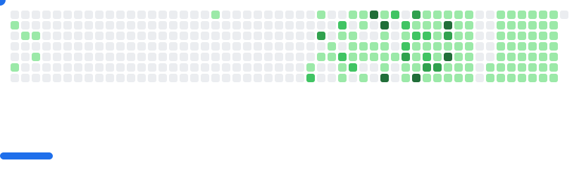

Quality is compromised by default as soon as "when?" is a matter of concern before "why?" is explained or "how?" is planned.

<picture>
  <source
    media="(prefers-color-scheme: dark)"
    srcset="images/breakout-dark.svg"
  />
  <source
    media="(prefers-color-scheme: light)"
    srcset="images/breakout-light.svg"
  />
  
</picture>
